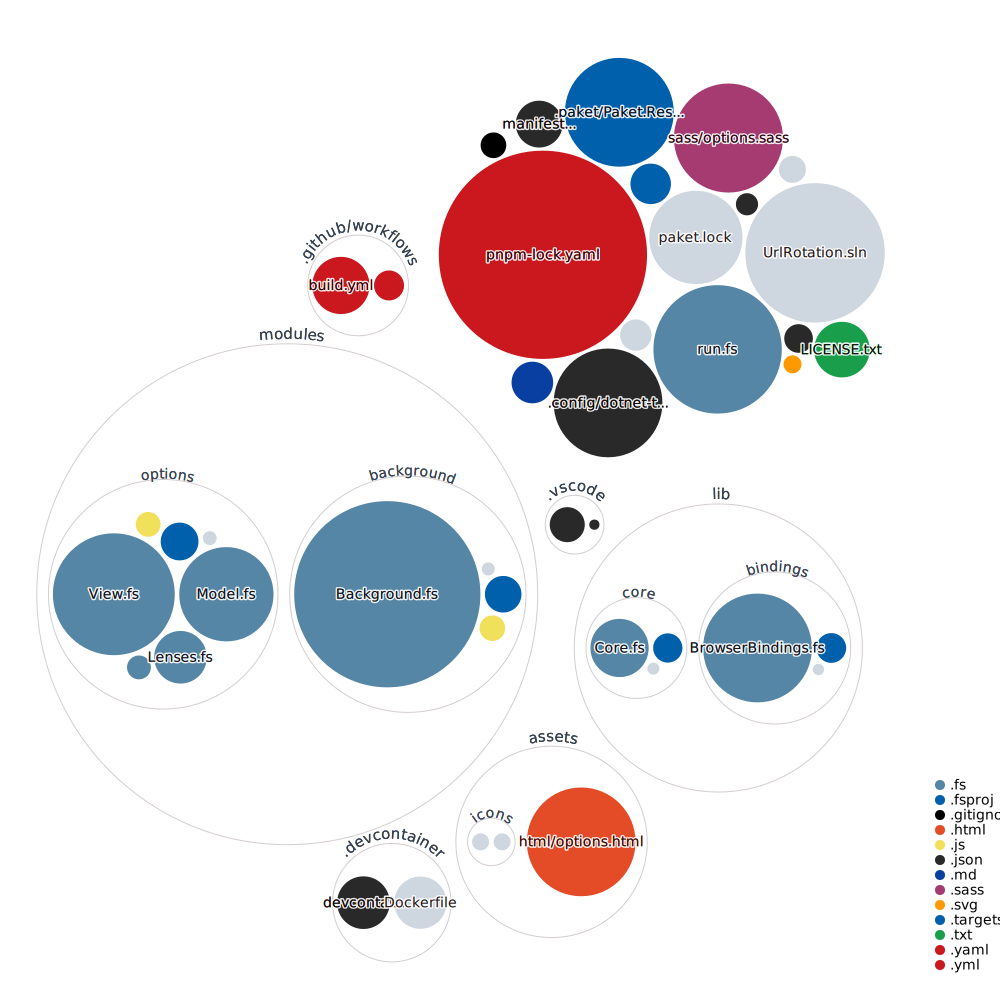

# Url Rotation

This is a browser extension in development which can be used for screens which should show different
urls. It is made for Firefox but will be made compatible with Chrome, if its ready.

It is inspired by [Tab Rotate for Chrome](https://github.com/KevinSheedy/chrome-tab-rotate).

To use the extnesion, first install it (either as a temporary addon or from extension store). Then open the
preferences of the extension and configure it like you need it. After that you can click
on the icon in the extension bar and start presenting the configured urls.

If you change the tab or close one of the tabs managed by the application, the playback will stop and
needs to be started again. The current state of the extension is easily seen at the icon.
It will show a play button if it is paused and a pause button if the rotation is running.

## Development

This diagram can give a hint about the structure of the repository. Each filled circle is a file.
The size of the circle corresponds to the size of the file. The color indicates the type (have a look
at the legend in the bottom right).
The circles around those filled circles are the folders.

### Get started
To jump into this it is highly recommended that you use VScode and the provided devcontainer.
You need VScode (with "Remote - Container" extension) and a running Docker setup.
After you open the cloned repo in VScode you can enter the devcontainer with the
"Remote Containers: Rebuild and Reopen in Container" command from the command palette
(if you don't know how to open it: View > Command Palette...).

To get a first look at the structure of the code, you can take the CodeTour "introduction"
which is part of the repo. The CodeTour extension is already installed inside of
the devcontainer.
To take the tour run the "CodeTour: Start Tour" command. The tour will try to explain
the structure of the code to you. Please consider giving feedback on this, because it
is one of the first times I tried something like that or even provide PRs with improvements <3

### Work with the code
When you want to start working with the code, you can build this project and enter
watch mode with `dotnet run watch`.
After that you can open `about:debugging` in Firefox and add the manifest.json as a temporary extension
for testing. You should consider reloading the extension and maybe option page to
see your changes and use the "Inspect" for the extension to see output from the background script.

### Commands
If you want to enter watch mode, run `dotnet run watch`.
If you want to just build once, run `dotnet run build`.
If you want to pack the extension ready to use (for Firefox only atm) you can run `dotnet run pack`.
